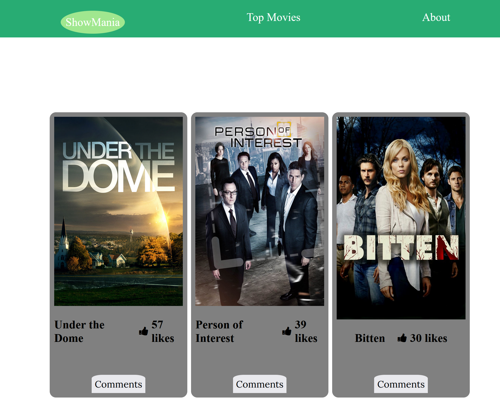

# javascript-capstone
>ShowMania is a website for shows where you can get in find your favourite show like it and leave a comment.
>It is built with HTML, CSS and JavaScript with data from TvMaze API(tv show data) and the Involvement API(likes and comments)

# Built With

- HTML

- CSS
    
- cJavascript
    
- HTML& CSS & Javaascript Linters
    
- Git
    
- Es6
    
- WebPack

# Live Demo 
[Live Demo](https://mugishasam123.github.io/javascript-capstone/)

# Run webpack server

`npm run start`

# Run build

`npm run build`

# Getting Started

Please get your browser update. To get a local copy up and running follow these simple steps.

Run the command below from the Terminal:

navigate to your projects folder

run git clone (https://github.com/mugishasam123/javascript-capstone.git) in your terminals

start index.html

Download all the dependencies run:

`npm install`

## 👤 Author

  #### Author 1 - Vana Seraydarian
- GitHub: [github](https://github.com/VSeray)
- Twitter: [twitter](https://twitter.com/home)
- LinkedIn: [Linkdin](https://www.linkedin.com/in/vana-seraydarian-936687191/?lipi=urn%3Ali%3Apage%3Ad_flagship3_feed%3BNyso4dw6Tz6UBL%2Fqkjvtvw%3D%3D)

#### Author 2 - Mugisha Samuel
- GitHub: [@mugishasamuel](https://github.com/mugishasam123)
- Twitter: [@mugishasamuel](https://twitter.com/mugishasamuel42/)
- LinkedIn: [mugishasamuel](https://www.linkedin.com/in/mugisha-samuel-55a905208/)

## 🤝 Contributing

Contributions, issues, and feature requests are welcome!

Feel free to check the [issues page](https://github.com/VSeray/Leaderboard/issues). 

# Show your support

Give a ⭐️ if you like this project! Acknowledgments

Entire Microverse team
My learning and coding partners

📝 License

This project is [MIT](https://github.com/microverseinc/readme-template/blob/master/MIT.md) licensed.